# Supplementary Material

In the Sections 5.2.1 and 5.2.2 of the paper, we describe our experiments and present the observed results. However, given the resemblance between results, we chose to extract some of the plots to this supplementary material in order to complete the proposed discussion.

For Fig. 3 of the paper, we present these complementary results:

1. Predictive performance on the Source2Target pre-training scenario on MovieLens 100k and 1M, using MovieLens 9.9M and 9M as Source, respectively.
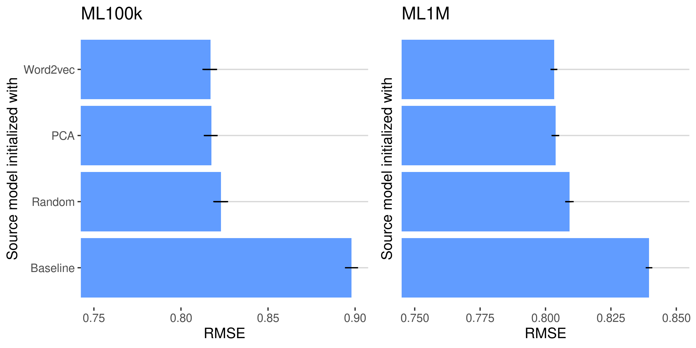

2. Predictive performance on the Source2Target pre-training scenario on MovieLens 100k and 1M, using MovieLens 19.9M and 19M as Source, respectively.
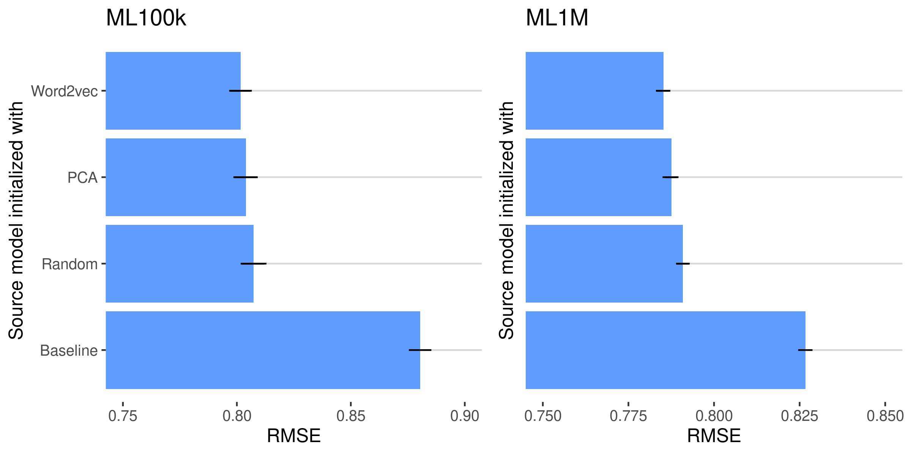

3. Predictive performance on the Source2Target pre-training scenario on MovieLens 100k and 1M, using MovieLens 24.9M and 24M as Source, respectively.
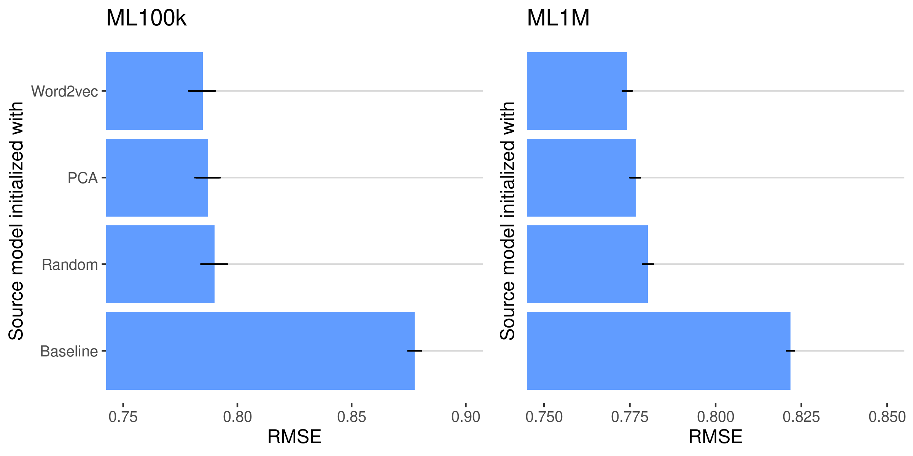

For Fig. 4 and 5, the results:

1. Predictive performance on MovieLens 100k using the Source2Target strategy considering MovieLens 9.9𝑀 as the source.
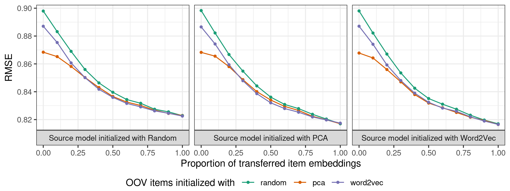

1. Predictive performance on MovieLens 100k using the Source2Target strategy considering MovieLens 19.9𝑀 as the source.
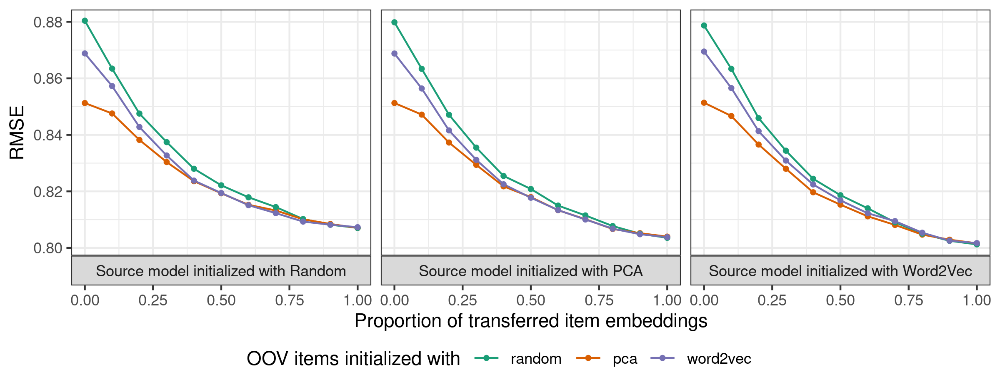

1. Predictive performance on MovieLens 100k using the Source2Target strategy considering MovieLens 24.9𝑀 as the source.
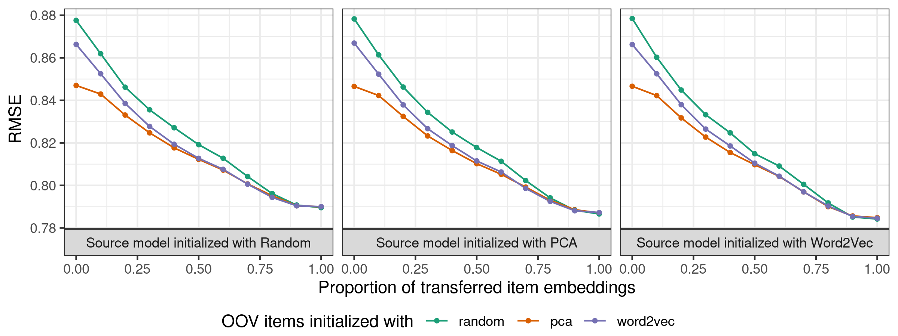

For Fig. 6 and 7:

1. Predictive performance on MovieLens 1M using the Source2Target strategy considering MovieLens 9𝑀 as the source.
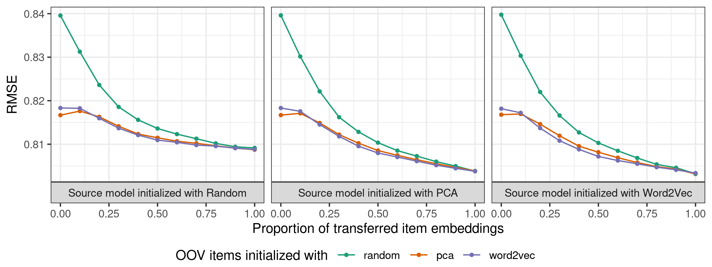

1. Predictive performance on MovieLens 1M using the Source2Target strategy considering MovieLens 19𝑀 as the source.
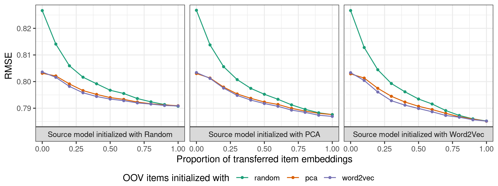

1. Predictive performance on MovieLens 1M using the Source2Target strategy considering MovieLens 24𝑀 as the source.
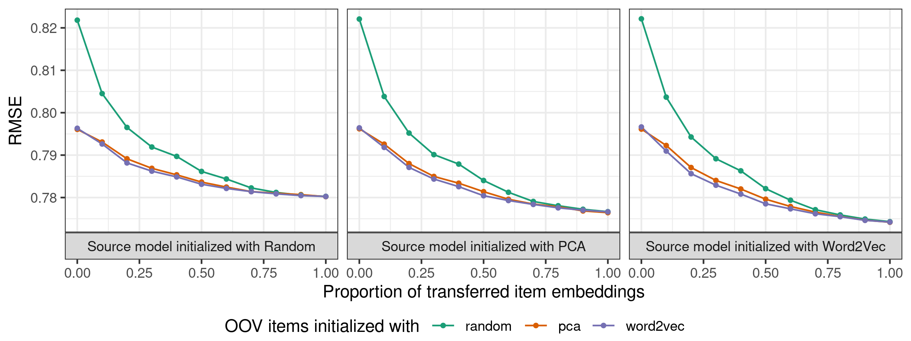

Lastly, for Fig. 9:
1. Loss landscape analysis for each initialization of the transfer between MovieLens 9.9M and 100k in the Source2Target strategy.
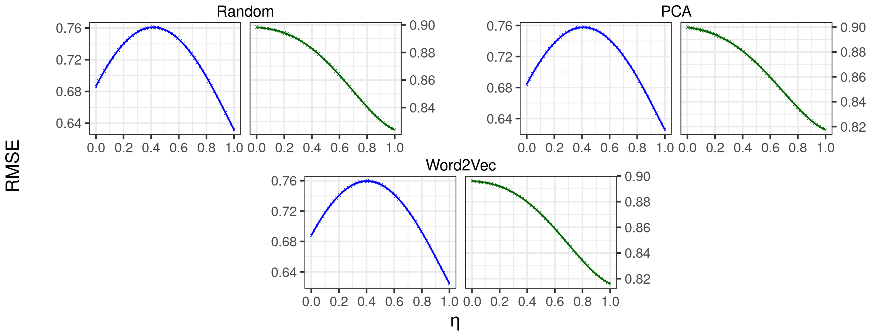

1. Loss landscape analysis for each initialization of the transfer between MovieLens 19.9M and 100k in the Source2Target strategy.
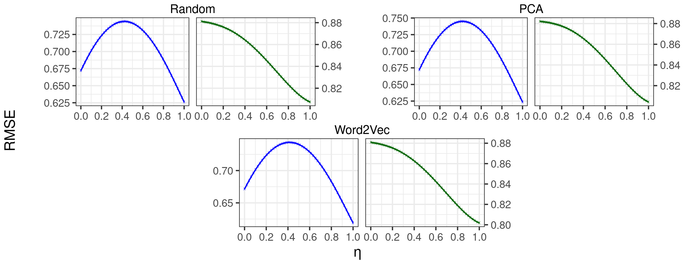

1. Loss landscape analysis for each initialization of the transfer between MovieLens 24.9M and 100k in the Source2Target strategy.
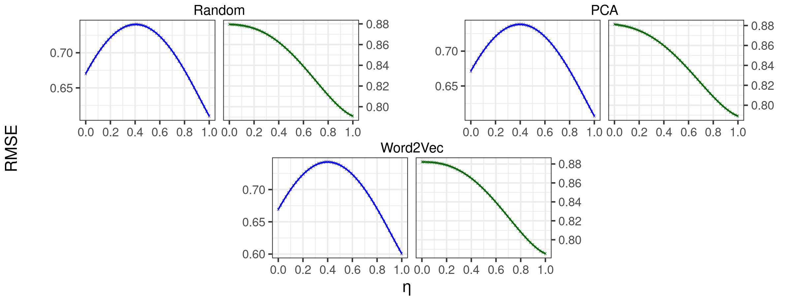

1. Loss landscape analysis for each initialization of the transfer between MovieLens 9M and 1M in the Source2Target strategy.
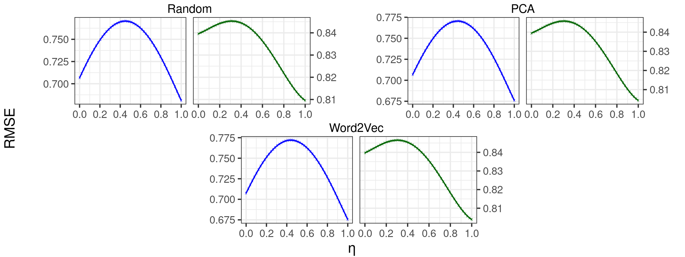

1. Loss landscape analysis for each initialization of the transfer between MovieLens 19M and 1M in the Source2Target strategy.
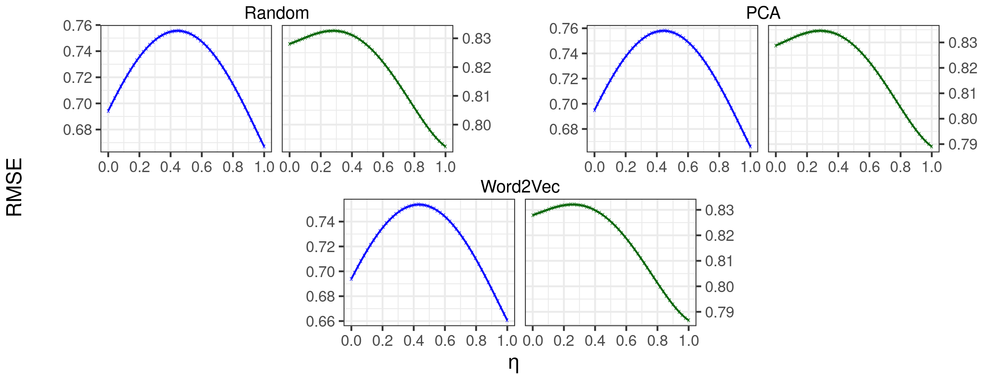

1. Loss landscape analysis for each initialization of the transfer between MovieLens 24M and 1M in the Source2Target strategy.
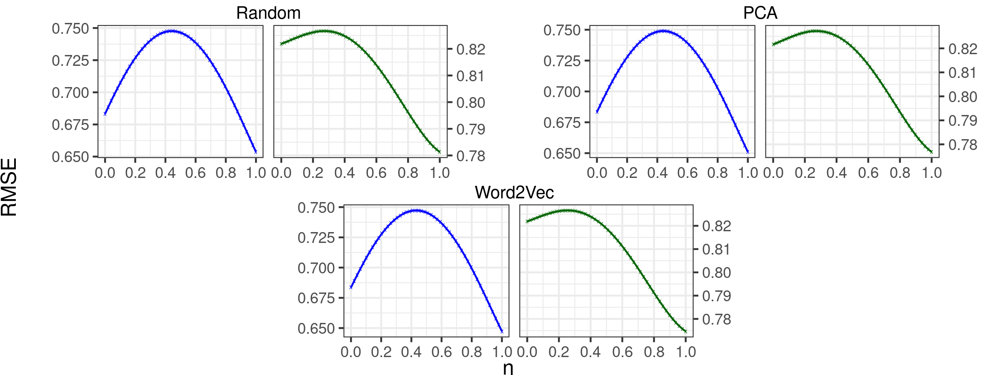