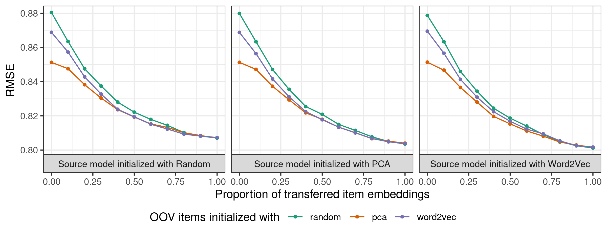
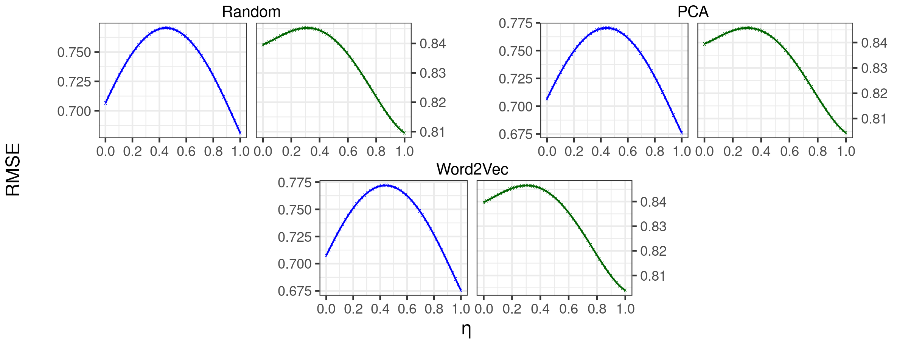
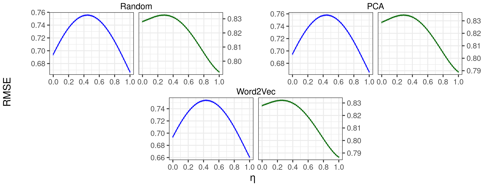
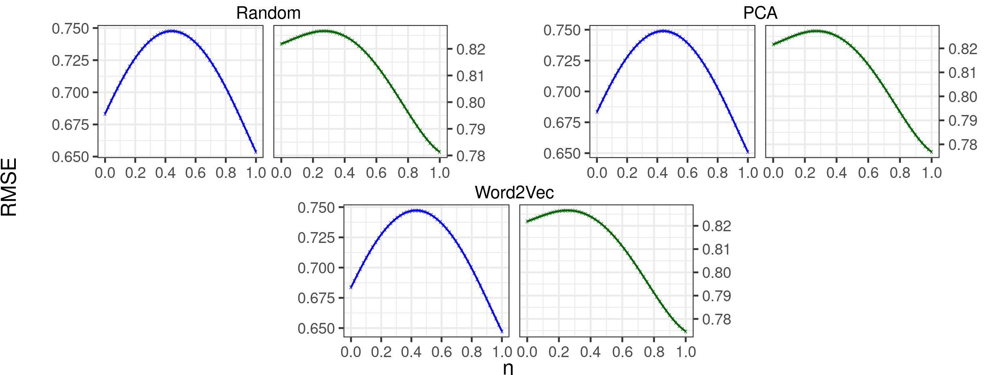

# Supplementary Material

This file supplements the results and adds more details regarding the paper. 

## Data sampling

As described in the paper, we generated artificial splits of the MovieLens 10M, 20M and 25M to execute our experiments. First, it is important to notice that the different versions of MovieLens come from the same data source, and can have overlappings between datasets (i.e. same user with a different id) and allowing a model to be trained and used as source for transfer learning means allowing the possibility of having the same user in the training set of the source model and in the test set of the target model, something we understand as data leakage. 

Despite our experiment with the Netflix dataset, in which we could also see benefits from pre-training, we needed a strategy for using the MovieLens dataset, and we chose to sample it. However, this sampling could not be random, otherwise it would also mean allowing the possibility of interference, since the same user would be in both the source and target, which is very unlikely - one does not expect that a great number Netflix users are also present in the MovieLens dataset, for instance. To avoid this problem, we randomly sampled users and extracted their interactions from the original dataset until we reached the goal number of interactions (100k and 1M), thus reaching a pair of datasets with a disjoint set of users.

Although this strategy solves the data leakage problem, one of its possible side effects is to extract all the interactions of an item to the target dataset, meaning that we will be unable to transfer that embedding from the source model, not intentionally creating a real scenario of OOV items. This problem is easily bypassed by having a target2target fallback initialization strategy.

## Identifying items between datasets

Since the Netflix items didn't share the same IDs as occurred in the MovieLens dataset, we followed a 3-stage title matching procedure to identify items common to both datasets:

1. We first pre-process the items' titles to lowercase and the same text encoding. Next, we try an exact match using the item title and year of release;
2. With the still unmatched items from the previous stage, we try an exact match now using only the item's itle;
3. Finally, for the remaining unmatched items from the two previous stages, we apply a weighted set of *string matching algorithms*, where we match an item of the source dataset with the higher-scored item of the target dataset when the score surpasses a certain acceptance threshold.

For the third stage, we used the available implementation of Indel [[1]](#additional-references) and Levenshtein [[2]](#additional-references) similarities in the [*Python Levenshtein* library](https://github.com/maxbachmann/Levenshtein) to score pairs of item titles. We also evaluated the similarities among the matching algorithms, using the Jaro [[3, 4]](#additional-references) and Jaro-Winkler [[5, 6]](#additional-references) similarities among the matching algorithms, but the results were inferior. While the cosine is a token-based measure, the Indel and Levenshtein are character-based, and setting a higher weight to the cosine similarity resulted in better matches. Finally, we normalized the similarities in the $[0, 1]$ scale and retrieved the item with the higher similarity, only considering it a good match if the average weighted similarity was above 75%.

The first stage usually finds most of the correct matches, while the second and third are fallbacks that may grant additional matches. Still, there are no guarantees that these matches are correct. For example, *A Star is Born (2018)* is a remake of *A Star is Born (1954)*, and ignoring the year of release might cause a mismatch. After applying these matching algorithms, we identified approximately 71.8% and 74.9% of the movies in the original MovieLens 100k and 1M, respectively, that are also present in the Netflix dataset.

## Results

In the Sections 5.2.1 and 5.2.2 of the paper, we describe our experiments and present the observed results. However, given the resemblance between results, we chose to extract some of the plots to this supplementary material in order to complete the proposed discussion.

### Figure 3

1. Predictive performance on the Source2Target pre-training scenario on MovieLens 100k and 1M, using MovieLens 9.9M and 9M as Source, respectively.

2. Predictive performance on the Source2Target pre-training scenario on MovieLens 100k and 1M, using MovieLens 19.9M and 19M as Source, respectively.

3. Predictive performance on the Source2Target pre-training scenario on MovieLens 100k and 1M, using MovieLens 24.9M and 24M as Source, respectively.

### Figure 4 - Target 100k

1. Predictive performance on MovieLens 100k using the Source2Target strategy considering MovieLens 9.9M as the source.

1. Predictive performance on MovieLens 100k using the Source2Target strategy considering MovieLens 19.9M as the source.

1. Predictive performance on MovieLens 100k using the Source2Target strategy considering MovieLens 24.9M as the source.

### Figure 4 - Target 1M

1. Predictive performance on MovieLens 1M using the Source2Target strategy considering MovieLens 9M as the source.

1. Predictive performance on MovieLens 1M using the Source2Target strategy considering MovieLens 19M as the source.

1. Predictive performance on MovieLens 1M using the Source2Target strategy considering MovieLens 24M as the source.

### Figure 5

1. Loss landscape analysis for each Target2Target initialization of MovieLens 100k.

1. Loss landscape analysis for each Target2Target initialization of MovieLens 1M.

1. Loss landscape analysis for each Target2Target initialization of MovieLens 10M.

1. Loss landscape analysis for each Target2Target initialization of MovieLens 20M.

1. Loss landscape analysis for each Target2Target initialization of MovieLens 25M.

### Figure 6 - Target 100k
1. Loss landscape analysis for each initialization of the transfer between MovieLens 9.9M and 100k in the Source2Target strategy.

1. Loss landscape analysis for each initialization of the transfer between MovieLens 19.9M and 100k in the Source2Target strategy.

1. Loss landscape analysis for each initialization of the transfer between MovieLens 24.9M and 100k in the Source2Target strategy.

### Figure 6 - Target 1M
1. Loss landscape analysis for each initialization of the transfer between MovieLens 9M and 1M in the Source2Target strategy.

1. Loss landscape analysis for each initialization of the transfer between MovieLens 19M and 1M in the Source2Target strategy.

1. Loss landscape analysis for each initialization of the transfer between MovieLens 24M and 1M in the Source2Target strategy.

## Additional References

* [1] Sun Wu and Udi Manber. 1992. Fast Text Searching: Allowing Errors. Commun. ACM 35, 10 (oct 1992), 83–91. https://doi.org/10.1145/135239.135244
* [2] Vladimir I Levenshtein et al. 1966. Binary codes capable of correcting deletions, insertions, and reversals. In Soviet physics doklady, Vol. 10. Soviet Union, 707–710
* [3] Matthew A Jaro. 1989. Advances in record-linkage methodology as applied to matching the 1985 census of Tampa, Florida. J. Amer. Statist. Assoc. 84, 406 (1989), 414–420.
* [4] Matthew A. Jaro. 1995. Probabilistic linkage of large public health data files. Statistics in Medicine 14, 5-7 (1995), 491–498. https://doi.org/10.1002/sim.4780140510 arXiv:https://arxiv.org/abs/https://onlinelibrary.wiley.com/doi/pdf/10.1002/sim.4780140510
* [5] William E Winkler. 1990. String comparator metrics and enhanced decision rules in the Fellegi-Sunter model of record linkage. (1990).
* [6] William E Winkler. 2006. Overview of record linkage and current research directions. In Bureau of the Census. Citeseer.